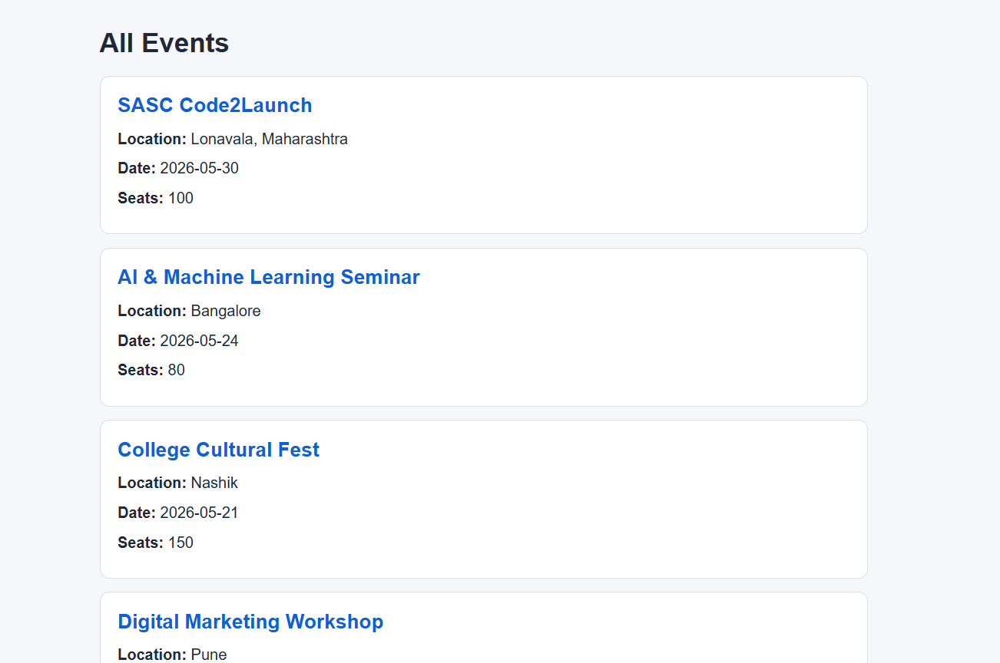
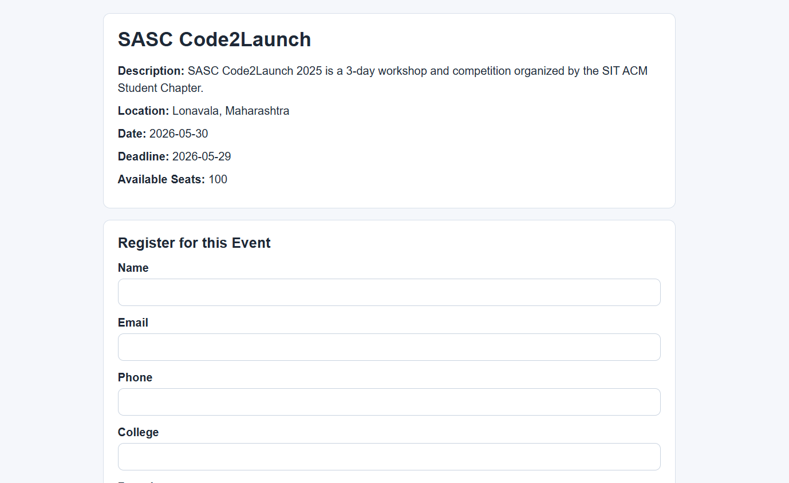
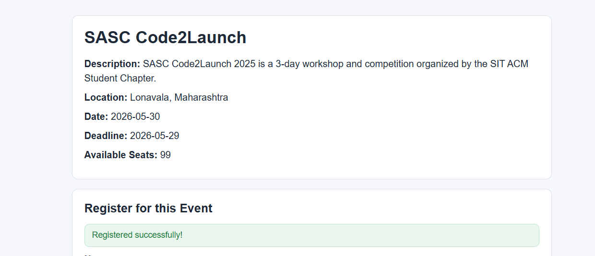
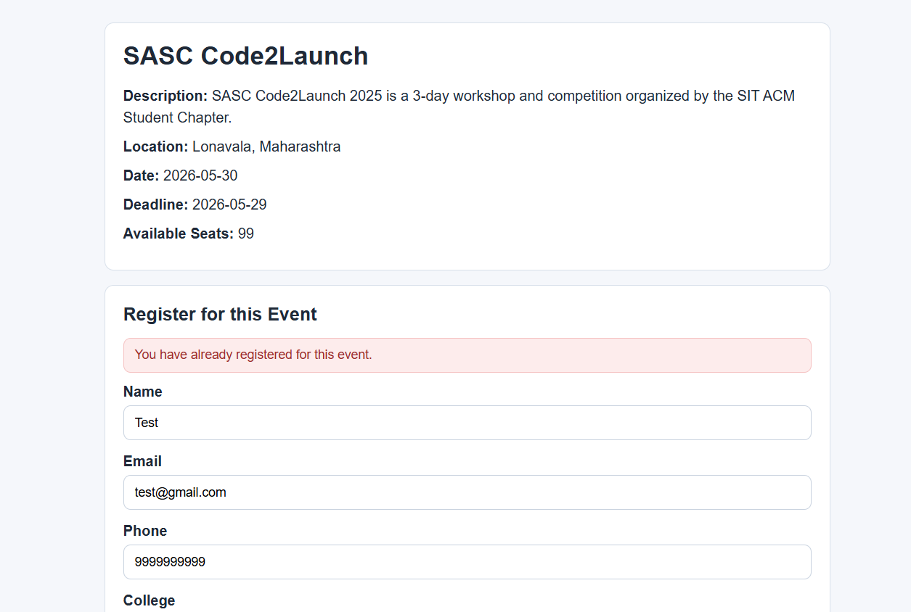
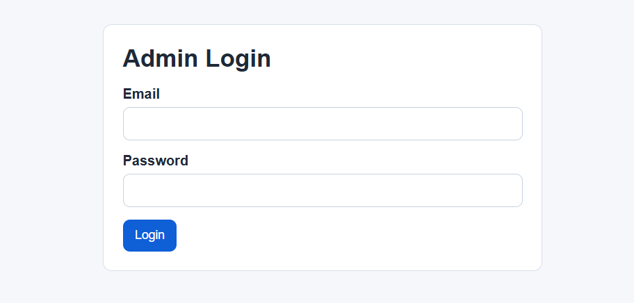
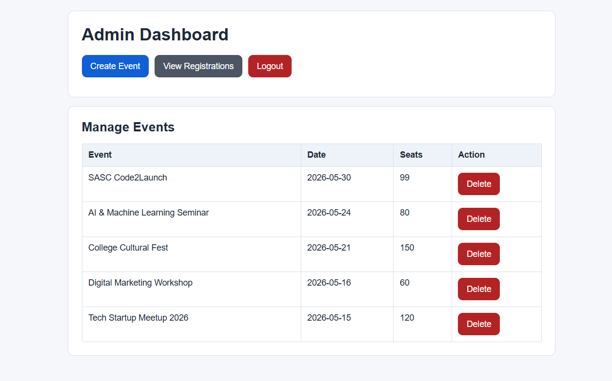
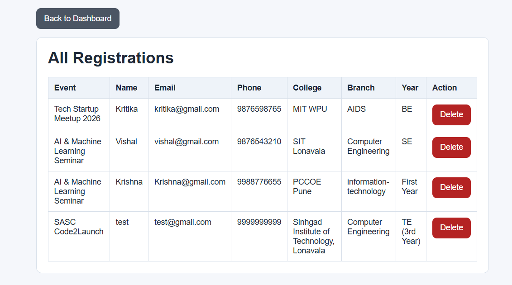

# EventFlow

EventFlow is a lightweight PHP event registration system built to manage event publishing, seat-limited registrations, and admin-controlled event operations without frameworks.

## Key Highlights

- Backend-focused architecture using PHP and MySQL
- Enforced data integrity using database constraints
- Prevented duplicate submissions using PRG pattern
- Implemented seat-limited registration logic
- Built complete admin panel with CRUD operations

## Problem Statement

Event registration systems often fail at three basic backend requirements:

- keeping event listings easy to manage,
- preventing duplicate submissions,
- enforcing seat limits reliably.

When these checks are handled only in the UI, the system becomes fragile. EventFlow addresses the problem at the backend level so registration remains consistent even when users refresh, resubmit forms, or attempt duplicate entries.

## Solution Overview

EventFlow uses a simple backend-first flow:

- admins create and manage events from a protected dashboard,
- public users browse events and submit registrations,
- the backend validates seat availability before insert,
- duplicate registrations are blocked using a database constraint,
- successful submissions use the PRG pattern to avoid repeat POST requests.

This keeps the system simple, predictable, and easy to maintain in a vanilla PHP + MySQL setup.

## Features

### Public Features

- View all published events
- View event details
- Register for an event

### Admin Features

- Session-based admin login
- Create event
- View registrations
- Delete registrations
- Delete events

### Backend Logic

- Duplicate prevention using `UNIQUE(event_id, email)`
- Seat availability check before insert
- Seat decrement after successful registration
- PRG pattern to prevent duplicate submission on refresh
- Input validation using `filter_input`
- SQL injection prevention using prepared statements

## Tech Stack

- PHP (Vanilla)
- MySQL
- XAMPP
- HTML + basic CSS

## Project Structure

```text
admin/
  login.php
  dashboard.php
  create_event.php
  registrations.php
  delete_event.php
  delete_registration.php
  logout.php

public/
  index.php
  event.php

config/
  db.php
```

### Folder Purpose

- `admin/`: protected admin pages for authentication, event creation, event cleanup, and registration management.
- `public/`: user-facing pages for browsing events and submitting registrations.
- `config/`: shared database bootstrap and connection setup.

## Database Schema

EventFlow uses two core tables.

### `events`

Stores the event records shown to users and managed by admins.

Typical fields used by the project:

- `id`
- `name`
- `description`
- `location`
- `event_date`
- `deadline`
- `total_seats`
- `created_at`

### `registrations`

Stores each user registration against an event.

Typical fields used by the project:

- `id`
- `event_id`
- `name`
- `email`
- `phone`
- `college`
- `branch`
- `year`
- `created_at`

### Relationship

- `registrations.event_id` references `events.id`

This relation ensures every registration belongs to one event.

### Why the UNIQUE Constraint Matters

The project relies on `UNIQUE(event_id, email)` to prevent the same email from registering multiple times for the same event.

This is important because backend checks alone are not enough under repeated submits or concurrent requests. The database constraint acts as the final line of defense.

## Key Backend Flows

### Event Creation Flow

1. Admin opens `create_event.php`.
2. The form is submitted via POST.
3. PHP inserts the event using a prepared statement.
4. The page redirects back with `?success=1` using PRG.

Example:

```sql
INSERT INTO events (name, description, location, event_date, deadline, total_seats)
VALUES (?, ?, ?, ?, ?, ?)
```

### Registration Flow

1. User opens an event page.
2. The backend fetches event details by ID.
3. On POST, the system checks whether seats are still available.
4. If seats exist, the registration is inserted.
5. Seat count is reduced by one.
6. The user is redirected to `event.php?id=X&success=1`.

Example:

```sql
INSERT INTO registrations (event_id, name, email, phone, college, branch, year)
VALUES (?, ?, ?, ?, ?, ?, ?)
```

### Seat Control Logic

Seat control is handled directly in the backend:

```sql
UPDATE events
SET total_seats = total_seats - 1
WHERE id = ?
```

The system checks available seats before insert. This keeps registrations tied to actual capacity.

### Duplicate Prevention

Duplicate prevention happens at two levels:

1. Application check for normal duplicate submissions.
2. Database-level `UNIQUE(event_id, email)` constraint.

If a duplicate is attempted, the database rejects it and the app shows a safe message.

### Admin Authentication

Admin pages use session-based authentication.

Flow:

1. Admin logs in through `admin/login.php`.
2. On valid credentials, `$_SESSION['admin'] = true` is set.
3. Protected pages verify the session before rendering.

This keeps admin actions behind a simple and clear access boundary.

## Screenshots

### Event Listing
Displays all available events ordered by latest creation.


---

### Event Details & Registration
Shows event information and allows users to register.


---

### Registration Success
Demonstrates PRG pattern and updated seat count after submission.


---

### Duplicate Registration Handling
Shows how duplicate entries are prevented using database constraints.


---

### Admin Login
Simple session-based authentication for admin access.


---

### Admin Dashboard
Manage events and perform delete operations.


---

### Registrations View
Displays all user registrations with event mapping using JOIN.


## Setup Instructions

1. Clone the repository.
2. Import the database into MySQL using phpMyAdmin or the MySQL CLI.
3. Update `config/db.php` with your local database credentials.
4. Place the project inside your XAMPP `htdocs` directory.
5. Start Apache and MySQL from XAMPP.
6. Open the public site in your browser.

### Recommended URLs

- Public event list: `http://localhost/eventflow/public/index.php`
- Event details: `http://localhost/eventflow/public/event.php?id=1`
- Admin login: `http://localhost/eventflow/admin/login.php`
- Admin dashboard: `http://localhost/eventflow/admin/dashboard.php`

### Admin Login

The current project uses a simple session-based login for local testing:

- Email: `admin@gmail.com`
- Password: `1234`

## Learning Outcomes

This project demonstrates practical backend fundamentals:

- backend flow design for registration systems
- database constraints for data integrity
- session handling for admin authentication
- PRG pattern for safer form handling
- prepared statements for SQL injection prevention
- consistency checks to keep seat counts accurate

## Future Improvements

- Add CSRF protection to forms
- Wrap seat update + registration insert in a transaction to reduce race-condition risk
- Improve UI polish while keeping the current simple structure

## Notes

- The project intentionally stays framework-free.
- The backend logic is kept simple so the flow is easy to audit and maintain.
- Security and consistency are enforced primarily through database constraints and prepared statements.